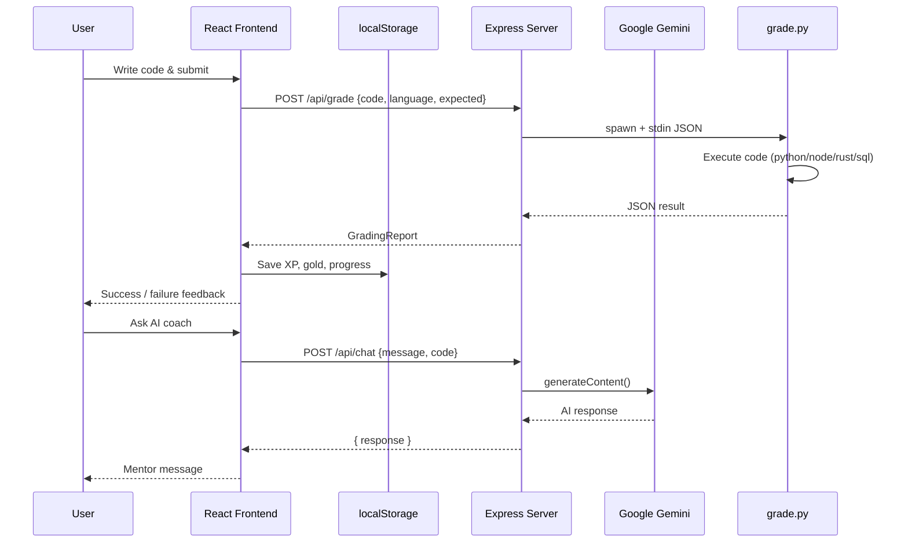

# CodeSyllabus Playground — Application Documentation

> **App name:** CodeSyllabus Playground (also branded as DevQuest in the workspace)  
> **Type:** Full-stack interactive programming learning platform  
> **Origin:** Google AI Studio app — [AI Studio link](https://ai.studio/apps/fb3688c7-f0d1-4750-a197-2eca92d56a7f)

---

## 1. Executive Summary

CodeSyllabus is a **brutalist-themed, gamified coding sandbox** where users learn programming through structured lesson tracks ("cities" and "floors"), write code in a live editor, submit solutions for automated grading, and chat with an AI mentor. Progress is tracked with XP, levels, and gold coins.

The app is designed as a **local/educational demo**, not a production-hardened platform. It combines a React frontend, an Express server, a Python grading engine, and Google Gemini for AI tutoring.

---

## 2. Architecture Overview

```
┌─────────────────────────────────────────────────────────────┐
│                     Browser (React SPA)                     │
│  App.tsx · SkylineMap · AiCoach · curriculum data           │
│  localStorage (auth, progress, accounts)                    │
└──────────────────────────┬──────────────────────────────────┘
                           │ fetch()
                           ▼
┌─────────────────────────────────────────────────────────────┐
│              Express Server (server.ts :3000)               │
│  POST /api/chat  ──► Google Gemini API (server-side key)  │
│  POST /api/grade ──► spawn grade.py ──► execute user code │
│  Dev: Vite middleware  |  Prod: static dist/              │
└──────────────────────────┬──────────────────────────────────┘
                           │ stdin/stdout
                           ▼
┌─────────────────────────────────────────────────────────────┐
│                   Python Grader (grade.py)                  │
│  Python exec · Node exec · SQLite · Rust compile · HTML   │
└─────────────────────────────────────────────────────────────┘
```

---

## 3. Tech Stack

| Layer | Technology | Purpose |
|-------|------------|---------|
| **Frontend** | React 19 | UI components and state |
| **Build** | Vite 6 + `@vitejs/plugin-react` | Dev server, bundling |
| **Styling** | Tailwind CSS 4 + custom neo-brutalist CSS | Layout and design system |
| **Icons** | Lucide React | UI icons |
| **Animation** | Motion | UI motion (where used) |
| **Backend** | Express 4 (TypeScript via `tsx`) | API routes, static serving |
| **AI** | `@google/genai` (Gemini 2.5 Flash / Pro) | SkyLine Coach Mentor chat |
| **Grading** | Python 3 (`grade.py`) + TS fallback in `server.ts` | Code validation & execution |
| **Fonts** | Google Fonts (Space Grotesk, Fira Code) | Typography |
| **Config** | `dotenv` | Environment variables |

---

## 4. Project Structure

```
devquest/
├── server.ts              # Express server, /api/chat, /api/grade
├── grade.py               # Python grading & code execution engine
├── index.html             # SPA shell
├── vite.config.ts         # Vite + Tailwind config
├── package.json           # Scripts and dependencies
├── .env.example           # Required env vars template
├── metadata.json          # AI Studio app metadata
├── src/
│   ├── App.tsx            # Main app (landing, workspace, about)
│   ├── main.tsx           # React entry point
│   ├── index.css          # Global styles
│   ├── types.ts           # TypeScript interfaces
│   ├── data/
│   │   └── curriculum.ts  # All lesson tracks and floors
│   ├── components/
│   │   ├── AiCoach.tsx    # Gemini-powered chat widget
│   │   └── SkylineMap.tsx # Lesson progress timeline
│   └── assets/images/
│       └── founder.png    # Founder profile photo
└── DOCUMENTATION.md       # This file
```

---

## 5. Core Features

### 5.1 Three Main Views

| Tab | Description |
|-----|-------------|
| **Landing** | Syllabus hub — pick a language track, view progress towers |
| **Workspace** | Code editor, lesson panel, grading output, AI coach |
| **About / Founder & Docs** | Platform info, founder profile, system documentation |

### 5.2 Language Tracks ("Cities")

Five active curriculum tracks in `curriculum.ts`, each with **12 floors** (60 lessons total):

| Track ID | Name | Execution support |
|----------|------|-------------------|
| `python` | Python Core Syllabus | Live `python -c` execution |
| `javascript` | JavaScript Web Syllabus | Live `node -e` execution |
| `sql` | SQL Relational Storage | In-memory SQLite sandbox |
| `html` | HTML Structural Layouts | Live preview in browser |
| `rust` | Rust Safe Core | `rustc` compile + run (or simulation fallback) |

> **Note:** `go`, `c`, `csharp`, `kotlin`, and `bash` appear in default progress state in `App.tsx` but have **no curriculum content yet** — placeholders for future tracks.

### 5.3 Lesson Structure (Each Floor)

Each floor includes:

- **Problem statement** — what to build
- **Starter code** — pre-filled editor template
- **testCode** — expected pattern for grading (`&&` = all required, `||` = any match)
- **Theory** — HTML explanation of the concept
- **Analogy** — physical metaphor for the concept
- **Difficulty** — `FOUNDATIONS`, `DYNAMICS`, or `ARCHITECT_SYSTEMS`

### 5.4 Grading Pipeline

1. User clicks **BUILD FLOOR SECTOR** (or **RUN** for execution-only)
2. Frontend POSTs to `/api/grade` with `{ language, code, expected, floor }`
3. Server spawns `grade.py` via stdin JSON payload
4. Python grader:
   - Executes code (Python/JS/Rust/SQL) with timeouts
   - Normalizes whitespace/quotes and checks against `expected` patterns
   - Returns `{ success, executionOutput, metrics, feedback }`
5. If Python fails, server falls back to a **TypeScript string-matching grader** (no execution)
6. On success: +100 XP, +50 gold, floor marked complete, level-up logic runs

### 5.5 AI Coach (SkyLine Coach Mentor)

- Component: `AiCoach.tsx`
- Endpoint: `POST /api/chat`
- Sends: user message, active language, floor number, current editor code
- Model: `gemini-2.5-flash` (primary), `gemini-2.5-pro` (fallback)
- Offline fallback: built-in canned hints if API is unavailable or key missing

### 5.6 Gamification

| Mechanic | Behavior |
|----------|----------|
| **XP** | +100 per passed floor; level up when XP ≥ maxXp |
| **Gold (CC)** | +50 per passed floor |
| **Level titles** | Apprentice → Associate Engineer → Senior Systems Fellow |
| **Progress** | Per-track floor completion stored in `completedFloors` |

### 5.7 User Accounts & Progress

| Feature | Storage | Notes |
|---------|---------|-------|
| Guest progress | `localStorage: codecity_universe_stats_v3` | XP, gold, completed floors |
| Registration | `localStorage: codesyllabus_registered_accounts` | Username, email, **plain-text password**, stats |
| Session | `localStorage: codesyllabus_session` | `{ username, email }` only |
| Export token | Base64-encoded JSON | Copy progress to clipboard |
| Import token | Paste base64 token | Restore/merge progress |

**There is no server-side database.** All user data lives in the browser.

---

## 6. API Reference

### `POST /api/chat`

**Request body:**
```json
{
  "message": "Explain variables with an analogy",
  "language": "python",
  "floor": 2,
  "code": "score = 100"
}
```

**Response:**
```json
{
  "response": "AI mentor reply text..."
}
```

### `POST /api/grade`

**Request body:**
```json
{
  "language": "python",
  "code": "print('Hello World')",
  "expected": "print(\"Hello World\")",
  "floor": 1
}
```

**Response:**
```json
{
  "success": true,
  "executionOutput": "Hello World\n",
  "metrics": {
    "linesOfCode": 1,
    "characterCount": 20,
    "commentCount": 0,
    "complexityRating": "Low"
  },
  "feedback": {
    "validationDetails": "...",
    "debuggerGuidance": "..."
  }
}
```

---

## 7. Environment Variables

| Variable | Required | Where used | Description |
|----------|----------|------------|-------------|
| `GEMINI_API_KEY` | Yes (for AI) | `server.ts` | Google Gemini API key — **server-side only** |
| `APP_URL` | Optional | AI Studio deployment | Hosted app URL for OAuth/callbacks |
| `NODE_ENV` | Optional | `server.ts` | `production` serves static `dist/` |
| `DISABLE_HMR` | Optional | `vite.config.ts` | Disables hot reload in AI Studio |

Copy `.env.example` to `.env` or `.env.local` and set your Gemini key:

```bash
GEMINI_API_KEY="your-key-here"
```

---

## 8. Running the App

```bash
npm install
# Set GEMINI_API_KEY in .env
npm run dev      # Starts Express + Vite on http://localhost:3000
npm run build    # Builds frontend + bundles server
npm start        # Runs production build
npm run lint     # TypeScript type check
```

**Prerequisites:** Node.js, Python 3 (for grading), optional Node.js CLI (for JS execution), optional `rustc` (for Rust floors).

---

## 9. Security Assessment

> **Overall verdict: This app is NOT production-secure.** It is appropriate for local learning, demos, and trusted single-user environments. Do **not** expose it publicly on the internet without major hardening.

### 9.1 Security Summary Table

| Area | Status | Risk | Details |
|------|--------|------|---------|
| API key handling | ✅ Good | Low | `GEMINI_API_KEY` stays server-side; not bundled into frontend |
| `.env` in gitignore | ✅ Good | Low | Secrets excluded from version control |
| User authentication | ❌ Not secure | **Critical** | Client-only; passwords stored in **plain text** in `localStorage` |
| Session management | ❌ Not secure | **High** | No tokens, cookies, or server validation — session JSON is forgeable |
| Code execution sandbox | ❌ Not secure | **Critical** | User code runs directly on the server (`python -c`, `node -e`, `rustc`) |
| API endpoint protection | ❌ Not secure | **High** | `/api/chat` and `/api/grade` have **no auth**, **no rate limits** |
| Input size limits | ❌ Missing | Medium | Large code payloads could cause DoS |
| Progress export tokens | ❌ Not secure | Low | Base64 JSON — unsigned, easily tampered |
| HTTPS | ⚠️ Deployment-dependent | Medium | App does not enforce TLS itself |
| CORS / CSRF | ❌ Not configured | Medium | No explicit CORS policy or CSRF tokens |
| Security headers | ❌ Missing | Low | No Helmet, CSP, or HSTS |
| SQL execution | ⚠️ Partially isolated | Medium | Runs against in-memory SQLite only — limited blast radius |
| Error messages | ⚠️ Leaky | Low | Some API errors return `error.message` to clients |
| Server binding | ⚠️ Open | Medium | Listens on `0.0.0.0:3000` — reachable from network if firewall allows |
| External fonts | ⚠️ Privacy | Low | Loads Google Fonts from CDN |

### 9.2 Critical Issues Explained

#### A. Arbitrary Code Execution (Highest Risk)

`grade.py` executes submitted code on the **host machine**:

```python
subprocess.run([sys.executable, "-c", code], timeout=2.0)   # Python
subprocess.run(["node", "-e", code], timeout=2.0)           # JavaScript
```

A 2-second timeout does **not** prevent:

- File system reads/writes (within timeout window)
- Network requests from Python/Node
- Resource exhaustion attacks
- Malicious Rust compilation attempts

**This is acceptable only in a trusted local dev environment.**

#### B. Client-Side Authentication

Registration stores credentials like this in `localStorage`:

```json
{
  "username": "demo",
  "email": "demo@example.com",
  "password": "plaintext123",
  "stats": { ... }
}
```

Anyone with browser DevTools can:

- Read all registered passwords
- Forge a session
- Modify XP/gold/completion data

This is **not real authentication** — it is a UI convenience for saving progress locally.

#### C. Unprotected API Endpoints

Both API routes are open to anyone who can reach the server:

- **`/api/chat`** — burns your Gemini API quota; user code is sent to Google
- **`/api/grade`** — triggers server-side code execution

No API keys, JWT, or IP restrictions are enforced.

### 9.3 What IS Reasonably Safe

| Item | Why |
|------|-----|
| Gemini API key | Never sent to browser; only used in `server.ts` |
| SQL lessons | Uses `:memory:` SQLite — no persistent DB to corrupt |
| Guest mode | No real accounts — just local progress |
| `.env` handling | Gitignored; example file has placeholder values |
| AI Studio deployment | Google manages infra; key injected via Secrets panel |

### 9.4 Recommendations Before Public Deployment

If you ever deploy this beyond localhost:

1. **Never run user code on the server directly** — use Docker/firecracker/gVisor sandboxes or a dedicated execution service (e.g. Judge0, Piston, AWS Lambda with strict limits).
2. **Replace localStorage auth** with a real backend: hashed passwords (bcrypt/argon2), JWT or session cookies, HTTPS-only.
3. **Add rate limiting** to `/api/chat` and `/api/grade` (e.g. `express-rate-limit`).
4. **Add request body size limits** (`express.json({ limit: '50kb' })`).
5. **Require authentication** for expensive endpoints, or use API keys.
6. **Add Helmet** for security headers and a Content Security Policy.
7. **Bind to localhost** in dev, or put behind a reverse proxy (nginx/Caddy) with TLS.
8. **Sign progress tokens** with HMAC if export/import is kept.
9. **Remove plain-text password storage** immediately if any real users register.

---

## 10. Data Flow Diagram



---

## 11. Quick Reference — Key Files

| File | Responsibility |
|------|----------------|
| `src/App.tsx` | Main UI, auth, grading calls, gamification, all three views |
| `src/data/curriculum.ts` | All 5 language tracks, 60 lessons, library references |
| `server.ts` | HTTP server, Gemini integration, grade subprocess |
| `grade.py` | Code execution, pattern matching, metrics |
| `src/components/AiCoach.tsx` | Chat UI wired to `/api/chat` |
| `src/components/SkylineMap.tsx` | Visual lesson progress map |
| `src/types.ts` | `Floor`, `City`, `UserStats`, `GradingReport`, `ChatMessage` |

---

## 12. Conclusion

**CodeSyllabus Playground** is a well-designed educational demo that teaches programming through gamified lessons, live code execution, and AI tutoring. It uses modern frontend tooling (React + Vite + Tailwind) with a lightweight Express backend and Python grading engine.

**For local learning and demos, it works well.**  
**For production use with real users on the public internet, it is not secure** — especially due to unauthenticated server-side code execution and client-side plain-text password storage.

Treat it as a **prototype/playground**, not a secured SaaS platform, unless you implement the hardening steps in Section 9.4.
